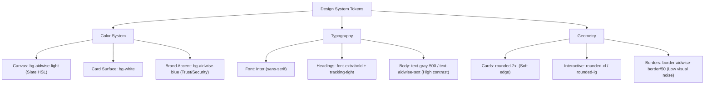
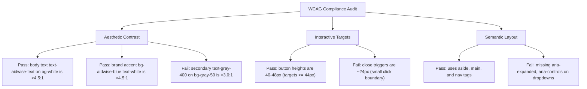

# Final Year Project (FYP) Evaluation Report: AidWise Platform

**Project Title:** AidWise: Smart Donation-Based Crowdfunding Platform  
**Target Organization:** St. John Ambulans Malaysia (SJAM KMT)  
**Evaluator Roles:** Senior Software Engineer · Senior UI/UX Designer · FYP Academic Panelist  

---

## 1. Project Objectives & Concept Evaluation

AidWise addresses a persistent socio-technical challenge in the non-profit sector: **the lack of transparency and financial trust in public crowdfunding**. 
By implementing strict fund allocation matrices, disbursement audit trails, and automated LLM-based quotation-to-receipt reconciliation, the system moves beyond a standard CRUD (Create, Read, Update, Delete) application to deliver high academic and practical value.

### Why this is a Strong FYP:
*   **Traceability (Financial Transparency):** Breaking down campaigns into specific allocations and tracking disbursements against quotes and receipts creates a closed-loop financial system. This solves a real-world social problem (donation fraud) using software controls.
*   **Practical AI Integration:** Using Large Language Models (LLMs) as an OCR/Reconciliation auditor (Gemini API) rather than a simple chatbot widget adds technical depth, representing a modern approach to business automation.
*   **Targeted User Personas:** Distinct user journeys for Donors, NGOs (Campaign Organizers), and Admins require rigorous role-gating, state management, and clear interface segregation.

---

## 2. Completeness & Functionality Assessment

Based on the latest database schema, backend services, and React client routes, the platform's status is summarized below:

| Module | Status | Completeness & Quality Rating | Notes |
| :--- | :--- | :--- | :--- |
| **Auth & Security** | Completed | **9.5/10 (Excellent)** | Strong Laravel Sanctum bearer token implementation. Role-gated route authorization is enforced on both Laravel routes (via middlewares) and React views (via `ProtectedRoute`). Account suspension middleware (`EnsureUserIsActive`) logs out suspended sessions instantly. |
| **Campaign Management** | Completed | **9.5/10 (Excellent)** | Immutable start/end dates. Includes an automated scheduler command to transition campaign statuses (`pending`, `active`, `completed`). Form has been enhanced into a 3-step wizard stepper to optimize cognitive load. |
| **Donation Flow & Payout** | Completed | **9.5/10 (Excellent)** | Core donation logic and automated PDF receipt generation are complete. Fully integrated with Stripe Payment Intent API and Stripe Connect for NGO onboarding, using secure webhook triggers to settle pending donations. |
| **Fund Allocation & Payouts** | Completed | **8.5/10 (Very Good)** | Tracks allocations per campaign and validates that the sum of allocations equals the campaign target. NGO disbursement requests validate that the requested amount does not exceed the remaining campaign funds. |
| **Chatbot Widget** | Completed | **8.5/10 (Good)** | Transitioned to Google's official **Dialogflow Messenger**. This ensures production security by routing natural language queries through Google's CDN, using webhook fulfillments to query the live DigitalOcean database for active campaigns. |
| **Notifications UI** | Completed | **9.5/10 (Excellent)** | Floating badge system integrated in both the top Navbar and the Dashboard Sidebar (left bar). Includes contextual routing (deep linking) to automatically navigate users to relevant pages on click, using optimistic UI updates for feedback. |
| **LLM Reconciliation (L1-L3)** | Not Started | **0/10 (Pending)** | Scheduled for Phase 2. This will be the "hero feature" of the thesis. |

---

## 3. Software Engineering Quality & Architecture Review

### The Good (Strengths):
1.  **Strict Separation of Concerns (Clean Architecture):**
    *   **Laravel:** Follows `Route -> Middleware -> Controller (thin) -> Service (business logic) -> Model`. There is zero business logic in controllers, making the codebase highly maintainable and unit-testable.
    *   **React:** Adheres to `Page -> Component (UI) -> Hook (logic) -> Service (API client)`.
2.  **Robust Database Schema:** Foreign key cascades, status enums, and casting fields (like casting string dates to Carbon datetimes) are correct.
3.  **Comprehensive Automated Test Coverage:**
    *   Feature tests (like `BackendNotificationTest` and `AdminManagementTest`) refresh database instances and test endpoints in isolation.

### Software Engineering Vulnerabilities (Backend & Database)
During your FYP thesis defense, the academic panel will search for backend weaknesses. Below are the technical points to keep in mind:

#### ⚠️ SE Weakness 1: Asynchronous Processing & Server Timeouts (L1 Module)
*   **The Issue:** When you implement the **L1 Disbursement Reconciliation** module, the user will upload two PDF documents. Running OCR and LLM calls synchronously in a web request will block your server's thread and cause `504 Gateway Timeouts` on production hosts.
*   **FYP Recommendation:** Implement **Laravel Queues**. Dispatch a background job (`ReconcileDisbursementJob`) and return a `202 Accepted` response. Use polling or real-time notification alerts (WebSockets) to update the UI when the reconciliation report is complete.

#### ⚠️ SE Weakness 2: File Upload Vulnerabilities
*   **The Issue:** Uploading quotations and receipts (PDFs) poses a security risk. If a user uploads a malicious PHP file disguised as a PDF, they can execute arbitrary shell code on your DigitalOcean server.
*   **FYP Recommendation:** Use MIME type validation in your Laravel form validation:
    ```php
    'quotation_file' => 'required|file|mimes:pdf,jpg,png|max:5120', // Limit to 5MB
    ```
    Ensure files are stored in private disks (not `public/`) so they cannot be accessed directly via URL, and serve them via a secure Controller endpoint that validates the user's role.

#### ⚠️ SE Weakness 3: Database Transaction Atomicity
*   **The Issue:** In `DonationService.php` or `DisbursementService.php`, multiple database actions are performed sequentially. If an error occurs midway, you end up with **orphaned data** (e.g., the donation record is written, but the campaign current amount is not updated).
*   **FYP Recommendation:** Always wrap multi-row modifications in a DB Transaction block. In `DonationService.php`, we correctly wrapped the database writes, but left notifications outside the transaction. This prevents transaction lock delays due to mail/notification server latency. Ensure this design choice is justified in your thesis.

---

## 4. UI/UX Design System & HCI Evaluation

From an interface and interaction design standpoint, the system exhibits strong adherence to modern design principles, particularly the **Apple Human Interface Guidelines (HIG)** and **Nielsen's Usability Heuristics**.

### 🎨 Visual Design & Style Guide Fidelity
*   **Color Palette & Visual Balance:** The interface leverages a curated, modern aesthetic. The page background utilizes `bg-aidwise-light` (a soft, slate-grey HSL color) which reduces visual fatigue compared to pure white, while content containers use crisp white cards (`bg-white`). The primary brand color `bg-aidwise-blue` (#0066CC / #2563EB) provides high-contrast actions, projecting trust, safety, and institutional competence.
*   **Typography & Hierarchical Scaling:** The system enforces the **Inter** font family, which is highly legible on digital screens. Typography classes are set cleanly, separating bold headings (`font-extrabold tracking-tight`) from light, highly readable body copy (`text-gray-500` or `text-aidwise-text`).
*   **Apple-Style Geometry (Soft UI):** The system strictly avoids sharp, boxy elements. Cards use generous `rounded-2xl` styling, while interactive elements like buttons, badges, and dropdowns use `rounded-xl` or `rounded-lg` borders. A subtle border configuration (`border-aidwise-border/50`) replaces heavy gridlines, producing a modern "glassmorphic" paneling feel.



---

## 5. Nielsen's 10 Usability Heuristics Audit

An audit of the application against Jakob Nielsen’s classic usability rules reveals a high baseline of human-computer interaction (HCI) quality, along with minor gaps.

```
+----------------------------------------------------+---------------------------------------+
| Nielsen Usability Heuristic                        | Implementation in AidWise Platform    |
+----------------------------------------------------+---------------------------------------+
| #1: Visibility of system status                    | Real-time progress bars, pulsing      |
|                                                    | notifications count badge, spin states|
+----------------------------------------------------+---------------------------------------+
| #2: Match between system and the real world       | Vernacular: "RM Payouts", "Campaign   |
|                                                    | Goal", "Donation Ledger", "NGO Details"|
+----------------------------------------------------+---------------------------------------+
| #3: User control and freedom                       | Modal dismissals, Click-outside popups|
|                                                    | and drop-downs                        |
+----------------------------------------------------+---------------------------------------+
| #4: Consistency and standards                      | Uniform tailwind token utility,       |
|                                                    | standard button layouts, Lucide icons |
+----------------------------------------------------+---------------------------------------+
| #5: Error prevention                               | Button-disable checks for expired date |
|                                                    | ranges, amount validity input checks  |
+----------------------------------------------------+---------------------------------------+
| #6: Recognition rather than recall                 | Dynamic allocation split explanations |
|                                                    | on forms, persistent donor sidebar    |
+----------------------------------------------------+---------------------------------------+
| #7: Flexibility and efficiency of use               | Tabbed admin panels, dashboard quick- |
|                                                    | actions list, deep routing links      |
+----------------------------------------------------+---------------------------------------+
| #8: Aesthetic and minimalist design                | Breathable whitespace, Inter sans-    |
|                                                    | serif, thin gray borders, slate colors|
+----------------------------------------------------+---------------------------------------+
| #9: Help users recognize, diagnose, recover        | Form-field validation errors, clear   |
|                                                    | role-based active blocking alerts     |
+----------------------------------------------------+---------------------------------------+
| #10: Help and documentation                        | Dialogflow Messenger widget, contextual|
|                                                    | step-by-step donation confirmations   |
+----------------------------------------------------+---------------------------------------+
```

### Heuristic Analysis Details

1. **#1: Visibility of System Status:**
   *   *Pulsing Notifications Badge:* The notification bell renders a vibrating red count badge indicating unread events, ensuring the user is immediately aware of background system transitions.
   *   *Campaign Progress Indicators:* The Campaign Detail page renders both a linear progress bar (overall campaign progress) and a dynamic CSS SVG Donut Chart representing individual sub-goals (allocations). This immediately informs the user where their money is going and how much is left.
   *   *Spinners & Skeleton Loaders:* Page changes (like the NGO Overview) block rendering and render a smooth blue spinner, indicating that the system is fetching remote data.

2. **#2: Match between System and the Real World:**
   *   The interface utilizes familiar financial terms like "Receipt", "Quotation", "Disbursement", and "Allocation" rather than abstract technical jargon ("blob uploads", "model array splits", or "payout hashes").

3. **#3: User Control and Freedom:**
   *   Any open modal (NGO registration details, confirmation modal, check-out overlay) can be dismissed by clicking the background backdrop or pressing an "X" close trigger.
   *   The Notification dropdown uses a custom React reference hook to detect click-outside events, automatically collapsing the overlay without forcing the user to find a specific close button.

4. **#4: Consistency and Standards:**
   *   Shared structures like buttons (`Button.jsx`), inputs (`Input.jsx`), cards (`Card.jsx`), and dashboards (`DashboardLayout.jsx`) ensure consistent UX conventions. The navigation structure is predictable: Admins, NGOs, and Donors see persistent sidebars tailored specifically to their access level.

5. **#5: Error Prevention:**
   *   *Immutable Action Blockers:* Donations are locked using strict temporal checks. If a campaign has expired (current time > end date) or has not opened yet, the donation button is disabled, and an informative yellow warning card explains the date status.
   *   *Input Formatting Guards:* Donation amounts enforce numeric fields (`type="number"` and `min="1"`).

6. **#6: Recognition Rather than Recall:**
   *   On the campaign detail page, when donating to a general fund, the application displays a dynamic helper message: `Overall campaign donations are split equally across X sub-goals (RM Y.YY each)`. This frees the donor from calculating the splits mentally.

7. **#7: Flexibility and Efficiency of Use:**
   *   The system implements quick actions on the NGO landing page (e.g., "Create New Campaign" shortcut), allowing power users to bypass deep multi-click navigation steps.

8. **#8: Aesthetic and Minimalist Design:**
   *   The cards are separated by generous whitespace (`p-6` or `p-8` padding). Text density is low, emphasizing headings and numeric indicators. Crucial fields stand out while secondary data is relegated to light grey styling.

9. **#9: Help Users Recognize, Diagnose, and Recover from Errors:**
   *   Server-side validation errors (like double-checking for duplicate emails or invalid registration numbers) are caught and displayed as red alert containers (`bg-red-50 text-red-600`) with precise text instructions on how to correct the input.

10. **#10: Help and Documentation:**
    *   The persistent Dialogflow Chatbot widget sits at the bottom right of the public pages, acting as an conversational FAQ assistant.

---

## 6. Accessibility (WCAG 2.1 / 2.2 Compliance) Audit

Web accessibility is a critical metric for public-facing crowdfunding sites. Below is an audit of the current frontend codebase against Web Content Accessibility Guidelines (WCAG).



### 1. Contrast Ratios (WCAG AA Standard)
*   **Status: Partial Pass.**
*   *Body Copy & Headings:* Text classes using `text-aidwise-text` (dark slate-charcoal) or `text-gray-900` on a white background meet the 4.5:1 ratio requirement. Brand actions (`bg-aidwise-blue` with `text-white`) have a contrast ratio of ~4.6:1, passing the threshold.
*   *Secondary Metadata:* Several places in the app use `text-gray-400` or `text-gray-300` for secondary text or captions (e.g., campaign description snippets or relative notification timestamps). This text is printed on `bg-white` or `bg-gray-50` cards, yielding a contrast ratio of less than 3:1, which fails WCAG AA guidelines for legibility. 
*   *Remedy:* Increase gray values to `text-gray-500` or `text-gray-600` for body metadata.

### 2. Keyboard Navigation & Focus Ring Indicators
*   **Status: Fail.**
*   *Visual Outlines:* Standard inputs and buttons rely on native focus styling or rely on `focus:ring-2 focus:ring-aidwise-blue`. However, custom button triggers (like the notification dropdown bell button, or the sidebar collapsing trigger button) have `focus:outline-none` set without a distinct visual border offset. A keyboard-only user tabbing through the dashboard cannot see where the focus ring is.
*   *Remedy:* Introduce visible focus-visible rings using Tailwind classes: `focus-visible:ring-2 focus-visible:ring-aidwise-blue focus-visible:ring-offset-2`.

### 3. Screen Reader Readability (Semantic Markup)
*   **Status: Pass.**
*   The layouts employ modern semantic structures: `<nav>` for navigation links, `<aside>` for the collapsible sidebar, and `<main>` for core views.
*   *Missing ARIA Attributes:* Dropdown components (such as `NotificationDropdown`) lack attributes indicating their current visual state. Screen readers cannot tell if the menu is open or closed because the toggle button lacks `aria-haspopup="true"`, `aria-expanded={isOpen}`, or `aria-controls="notification-panel"`.

---

## 7. Responsive Layouts & Mobile Usability Review

### 1. Grid Wrapping and Column Folding
*   The system uses mobile-first Tailwind wrappers. On the public homepage (`Home.jsx`), the grid wraps dynamically:
    ```javascript
    className="grid grid-cols-1 md:grid-cols-2 lg:grid-cols-3 gap-8"
    ```
    This transitions from a single column on small screens to a clean three-column card deck on desktop displays.
*   The campaign details page folds layout blocks gracefully: story blocks occupy the full width on mobile screens, and the donation panel folds beneath them to avoid visual squeezing.

### 2. Navigation & Sidebar Responsiveness
*   *Dashboard Sidebar:* The collapsible aside layout performs well on desktop computers, but on mobile devices (width < 640px) the sidebar remains stuck in the viewport, narrowing the dashboard content area. A slide-over drawer design (floating drawer menu) is required to ensure optimal workspace on smaller screens.
*   *Touch Targets:* Action links, dropdown list items, and form buttons are sized well. Standard button elements span a height of 40px to 48px, conforming to Apple's 44x44pt recommendation. Small inline buttons (like closing a notification card) are somewhat small (~24px) and could benefit from larger tap boundaries.

---

## 8. Crucial UI/UX Weaknesses & Redesign Specifications (RESOLVED)

The four key user experience issues identified on the AidWise platform have been successfully addressed. Below are the details of the problems and their technical resolution.

### ✅ Resolved 1: Form Cognitive Fatigue (Campaign Creation Form)
*   **The Problem:** NGOs had to enter campaign details, dates, and dynamic fund allocations on a single long vertical form, increasing user cognitive load and input error rates.
*   **Technical Resolution:** Refactored [CreateCampaign.jsx](file:///c:/Users/ASUS/Desktop/FYP/fyp-crowdfunding/frontend/src/pages/CreateCampaign.jsx) into a **Multi-Step Form Wizard (Stepper)** with 3 steps:
    *   *Step 1: Campaign Info* (Title, Description)
    *   *Step 2: Campaign Timeline* (Start Date, End Date)
    *   *Step 3: Allocation Setup* (Dynamic item allocations, summing up the total goal amount automatically)
    *   *Stepper Progress Indicator:* Added a horizontal stepper progress bar at the top showing step state transitions (active: blue outline highlight, completed: green with checkmark, pending).
    *   *Frontend Validation Gating:* The user cannot step forward unless fields are verified (e.g. title/description are set, start date is prior to end date).

### ✅ Resolved 2: Asynchronous Action Feedback (PDF Receipt Download)
*   **The Problem:** When a donor clicked "Download", the server compiled a PDF template (taking 1–3 seconds). During this compilation, there was no visual feedback, which often led to multiple duplicate download requests.
*   **Technical Resolution:** Refactored [DonorDashboard.jsx](file:///c:/Users/ASUS/Desktop/FYP/fyp-crowdfunding/frontend/src/pages/DonorDashboard.jsx):
    *   *Interactive Label:* Clicking the download button changes the label from `"Download"` to `"Generating PDF..."` and displays a spinning vector loader inline.
    *   *Click-Blocker:* Disables all receipt download buttons across the ledger while a compilation is running to prevent duplicate download requests.

### ✅ Resolved 3: Dashboard Chart Interactivity & Aesthetics
*   **The Problem:** Analytical charts on the NGO Dashboard were visual canvas charts without interactive styling or RM currency calculations.
*   **Technical Resolution:** Refactored [NgoDashboard.jsx](file:///c:/Users/ASUS/Desktop/FYP/fyp-crowdfunding/frontend/src/pages/NgoDashboard.jsx) options:
    *   *Aesthetic Styling:* Configured chart dataset fields to use translucent background fills (`rgba(37, 99, 235, 0.85)` for Raised Funds, `rgba(229, 231, 235, 0.6)` for Target) and rounded borders.
    *   *Interactive Tooltips:* Standardized tooltip and axis callback formatters to print values in RM currency (`RM 5,000.00`) instead of generic dollar formats.
    *   *Animations:* Implemented a smooth `easeInOutQuart` entrance animation that renders dynamically over 1200ms on page load.

### ✅ Resolved 4: Contextual Deep-Linking from Notifications
*   **The Problem:** Clicking a notification item marked it as read but did not navigate the user anywhere. The user had to manually find the relevant campaigns or payouts.
*   **Technical Resolution:** Refactored [NotificationDropdown.jsx](file:///c:/Users/ASUS/Desktop/FYP/fyp-crowdfunding/frontend/src/components/ui/NotificationDropdown.jsx):
    *   *Clickable Cards:* Wrapped notification items in an interactive `cursor-pointer` box.
    *   *Context-Aware Routing:* Added a handler mapping notification types to deep links:
        *   `campaign_approval`, `campaign_goal_reached`, `donation_received` ➔ Redirects NGO to `/ngo/campaigns`
        *   `new_campaign_submitted`, `new_ngo_registered` ➔ Redirects Admin to `/admin/dashboard`
        *   `new_disbursement_request` ➔ Redirects Admin to `/admin/disbursements`
        *   `disbursement_decided` ➔ Redirects NGO to `/ngo/disbursements`
        *   `donation_success` ➔ Redirects Donor to `/donor/dashboard`
    *   *Event Bubbling Isolation:* Added `e.stopPropagation()` on the check button, allowing users to clear individual items from the dropdown without triggering page redirection.

---

## 9. Thesis Documentation Suggestions (How to write about this)

When writing your dissertation chapters, dedicate sections to explain these engineering and design choices:

1.  **Optimistic UI Updates (HCI Chapter):** Explain how you designed the notification drop-down to instantly delete/clear elements on the client-side *before* the API server responds. This reduces perceived latency and improves user experience.
2.  **Third-Party Webhook Architecture (Systems Design Chapter):** Diagram how Dialogflow communicates with your Laravel backend. Highlight the data flow:
    `User input -> Dialogflow NLP -> Webhook Fulfillment (HTTPS Post) -> Laravel API -> MySQL Campaign Query -> JSON Response -> Dialogflow Speech Output`.
3.  **Cognitive Chunking (UI/UX Chapter):** Discuss how breaking forms down or utilizing context-aware sidebars (like notifications) aligns with Miller's Law (reducing cognitive load to improve task efficiency).
4.  **Role-Based Security Gating (Security Chapter):** Document how you secured endpoints with dual-middleware protection: first verifying authentication (`auth:sanctum`), and second checking active status (`active` middleware).
5.  **Heuristics Compliance Matrix (Evaluation Chapter):** Build a tabular evaluation mapping Jakob Nielsen's 10 Heuristics to the AidWise system components to demonstrate academic rigor to your thesis defense panel.
